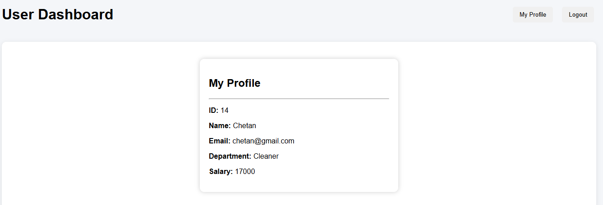
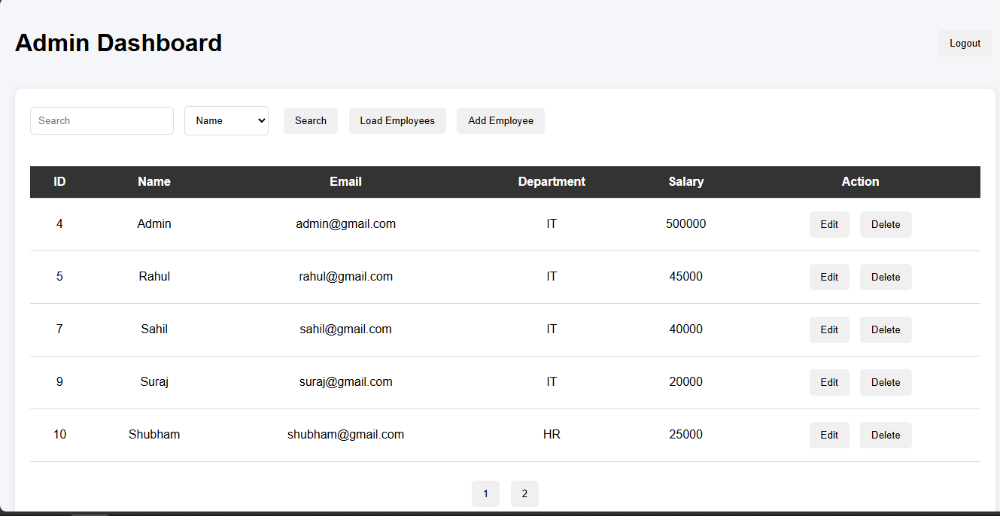
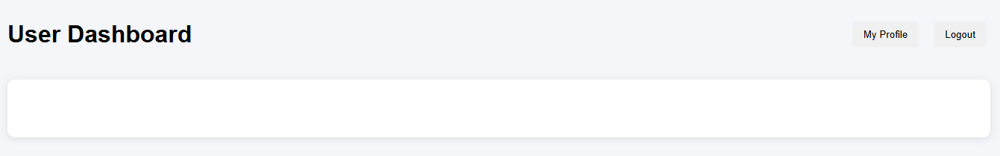

Employee Management System

Employee Management System built using Java Full Stack technologies.

> Features
- Employee CRUD operations
- JWT Authentication
- Spring Security
- Role-based access (ADMIN / USER)
- Search and filter
- Pagination
- User profile
- MySQL database integration

> Tech Stack
 Backend:
- Java
- Spring Boot
- Spring Security
- Spring Data JPA
- Hibernate
- MySQL

 Frontend:
- HTML
- CSS
- JavaScript

> Setup
1. Clone project    git clone REPOSITORY_URL
2. Configure database in application.properties
3. Run Spring Boot application
4. Open: http://localhost:8080/login

>  Roles
ADMIN:
- Add employee
- Edit employee
- Delete employee
- Search employee

USER:
- Login
- View profile

> Project Architecture
Employee Management System follows a layered architecture:

Controller Layer
↓
Service Layer
↓
Repository Layer
↓
MySQL Database

Authentication Flow:

User Login
↓
JWT Token Generated
↓
Token Stored in Browser Local Storage
↓
Token Sent in Authorization Header
↓
Spring Security + JWT Filter Validates User
↓
Access Granted Based on Role

> API Endpoints

Authentication:POST /auth/login

Employee:
GET /employee
GET /employee/{id}
POST /employee
PUT /employee/{id}
DELETE /employee/{id}
Search:
GET /employee/search/filter

> Learning Outcomes
- Implemented JWT authentication
- Learned Spring Security authorization
- Built role-based access control
- Designed REST APIs using Spring Boot
- Integrated MySQL with JPA/Hibernate
- Global ExeptionHandling

> Future Enhancements
- Dashboard statistics
- Email notifications
- Password reset functionality
- Employee update request approval system
- Deployment using Docker and AWS

> Screenshots

Login Page

Admin Dashboard

Employee Dashboard

